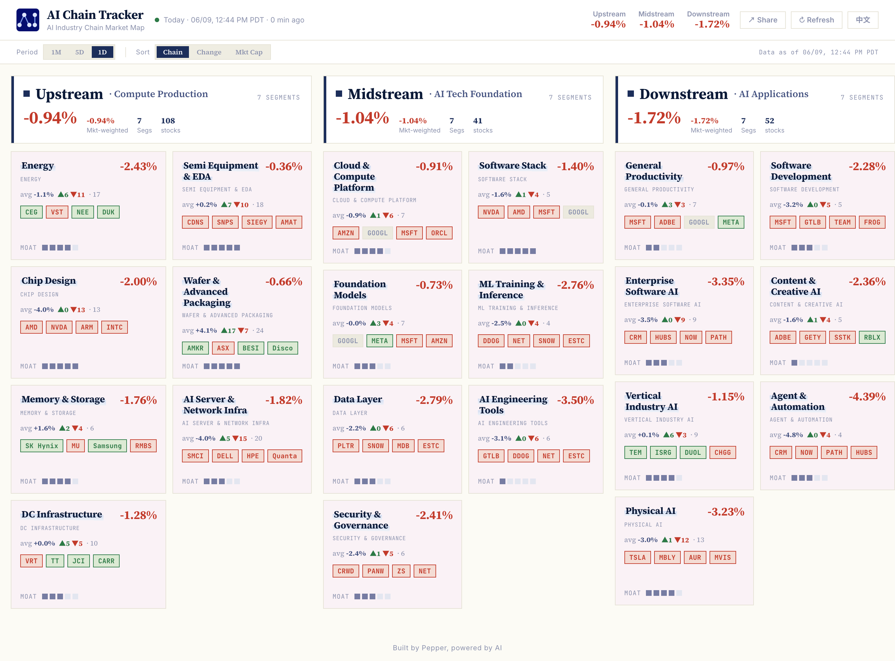
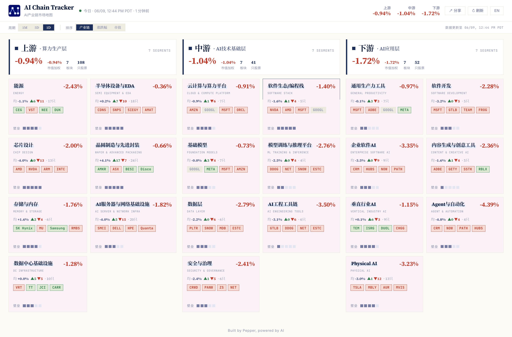

# AI Chain Tracker Showcase

AI Chain Tracker is a market-structure visualization product for exploring how
AI-related public-market themes move across a curated research model.

This public repository is a product showcase. It demonstrates the interface
shape, architecture direction, deployment pattern, and engineering discipline.
The production ticker universe, segment taxonomy, subsegment taxonomy,
weighting model, ranking model, and calculation method are private research
assets and are not included.

## Live Product

Live site: [https://artory.cc/](https://artory.cc/)

Public demo with synthetic data:
[https://peppersun.github.io/AI-Chain-Stock-Tracker/](https://peppersun.github.io/AI-Chain-Stock-Tracker/)

English homepage:



Chinese homepage:




## What Is Included

- A static demo interface using synthetic display units only.
- Demo-only helper code that does not mirror the production calculation model.
- High-level architecture notes for the public showcase.
- Example static Cloudflare Pages configuration.
- Tests that check the demo data and guard against accidental private-data leaks.

## What Is Not Included

- Production ticker lists.
- Production segment or subsegment lists.
- Production weighting, ranking, aggregation, or sorting logic.
- Original research files, spreadsheets, PRDs, or design drafts.
- API keys, local Cloudflare state, production storage identifiers, or
  deployment secrets.

## Local Preview

```bash
npm test
npm run serve
```

Then open:

```text
http://127.0.0.1:8080
```

The page can also be opened directly from `index.html`, but serving it locally
keeps browser module loading behavior closer to deployment.

## Deployment Notes

The production project is designed around Cloudflare Pages and edge functions.
This showcase repository includes `wrangler.example.toml` for a static demo
deployment only.

Secrets and production storage bindings are intentionally outside this public
repository.

## Data Policy

Demo data is synthetic and intentionally incomplete. It is not a sample from the
production universe and should not be interpreted as a market view.

The private research assets are deliberately excluded to preserve the product's
research moat while still making the engineering approach discussable.

## Disclaimer

This repository is not investment advice, financial advice, or a trading
recommendation. The demo data is synthetic and has no investment meaning.

## License

Source-available showcase. All rights reserved. See `LICENSE`.
