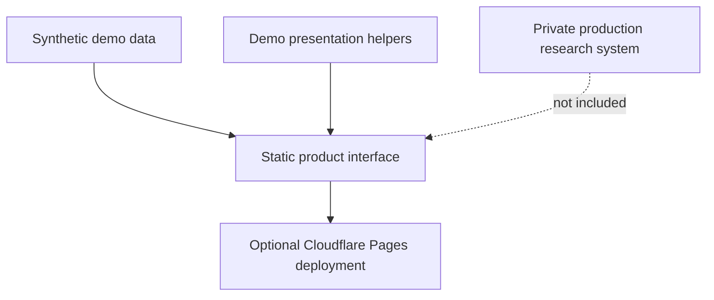

# Public Architecture Overview

This document describes the public showcase architecture at a high level. It is
not a production implementation document and intentionally omits the private
research model.

## Public Showcase Flow

- The browser loads `index.html`.
- `src/sample-data.js` provides synthetic display units.
- `src/sample-weighting.js` formats demo values for presentation.
- No production market-data provider is called by this showcase.
- No production taxonomy, ranking, or aggregation method is included.

## Production Concepts Not Included

- Private ticker universe construction.
- Private taxonomy and sub-taxonomy.
- Private weighting, ranking, aggregation, and sorting methods.
- Original research documents and spreadsheets.
- Production Cloudflare storage bindings, resource identifiers, and secrets.

## Why The Repository Is Structured This Way

The goal is to let the community evaluate the product concept and engineering
presentation without giving away the private research system that powers the
production application.
